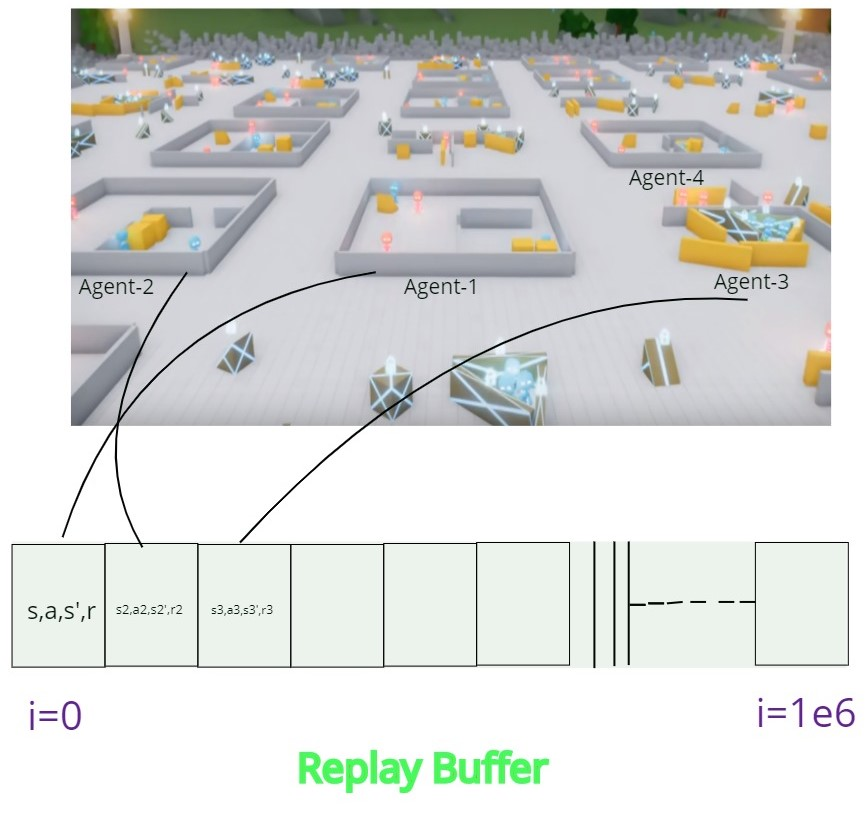
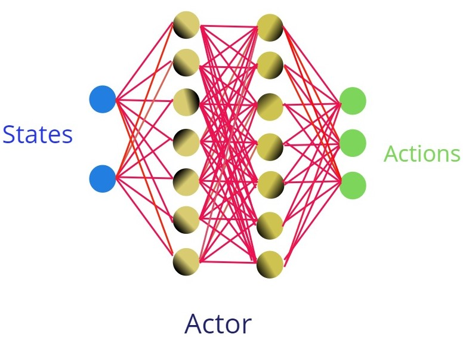
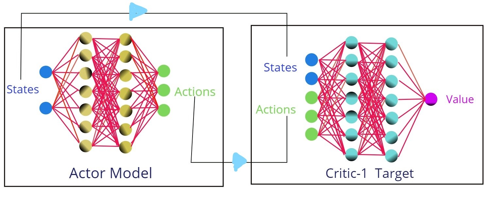
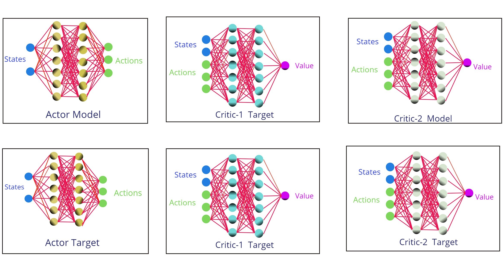
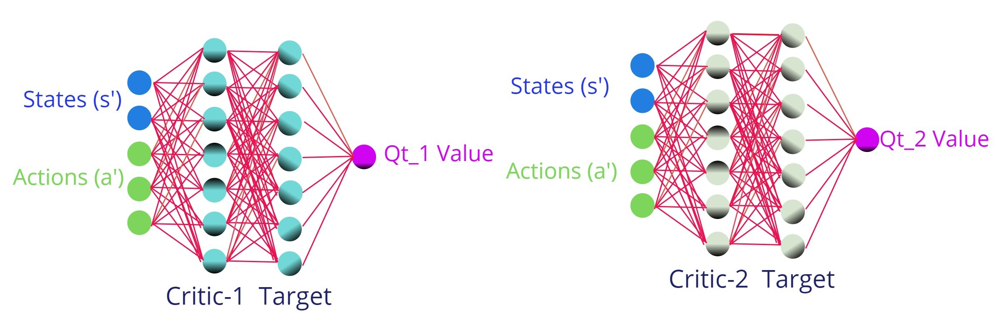
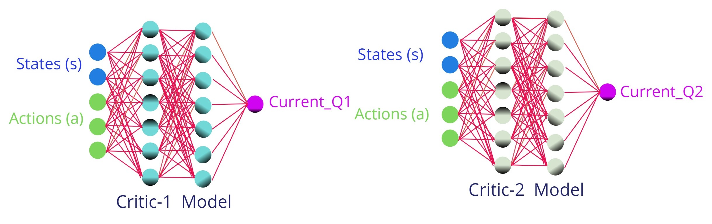

# Twin Delayed Deep Deterministic Policy Gradient (TD3)

### 1. Experience Memory    

Store the 100,000 initial Transitions (state,action,next_state,reward) in Replay buffer (Experience Replay).
All the agents in the environment running parallely contributes its experience to the Replay buffer. In this 
example a replay buffer size of 100,000 is used. After the 100,000 initial transition, Later transitions are stored in same Replay       Buffer by over writing the transition of intially stored transition.

  
 

       class ReplayMemory(object):

        def __init__(self, max_size = 1e6):
            self.max_size = max_size
            self.storage = []
            self.ptr = 0

        def add(self, transition):
            if len(self.storage) == self.max_size:
                self.storage[self.ptr] = transition
                self.ptr = (self.position + 1) % self.max_size
            else:
                self.storage.append(None)

        def sample(self, batch_size):
            index = np.random.randint(0,len(self.storage),batch_size)
            batch_states, batch_next_states, batch_actions, batch_rewards, \
            batch_done = [],[],[],[],[]
            for i in ind :
                state,next_state,action,reward,done = self.storage[i]
                batch_states.append(np.array(state, copy = False))
                batch_next_states.append(np.array(next_state, copy = False))
                batch_actions.append(np.array(action, copy = False))
                batch_rewards.append(np.array(reward, copy = False))
                batch_done.append(np.array(done, copy = False))
            return np.array(batch_states), np.array(batch_next_states), \
                  np.array(batch_actions), np.array(batch_rewards).reshape(-1,1), \
                  np.array(batch_done).reshape(-1,1)

   add(transition) -> Stores the transition in storage list ,if the storage list is completely filled  
                      then new transition will be overwritten from index 0 again. 
                      
   sample (batch_size) -> returns the collection of Transition of batch_size from the Transitions available in the Storage.
     
     
     
### 2. ACTOR DNN :

    
   Creates the Actor which receives states as input and actions are provided as output.
   It also has max_action value to clip the action taken by agent in [- max_action , max_action]
   

  
 

  
    class Actor(nn.Module):

      def __init__(self,state_dims, action_dims, max_action):
        # activate Inheritance , Intialize all the variables of Parent class
        super(Actor,self).__init__()
        self.layer_1 = nn.Linear(state_dims, 400)
        self.layer_2 = nn.Linear(400,300)
        self.layer_3 = nn.Linear(300,action_dims)
        #max_action is to clip in case we added too much noise
        self.max_action = max_action

      def forward(self,x):
        x = F.relu(self.layer_1(x))
        x = F.relu(self.layer_2(x))
        x = self.max_action * torch.tanh(self.layer_3(x))
        return x

The state_dims are extracted from the images and random action / policy based action is given by DNN.
In T3D, same DNN is used for both ACTOR-model and ACTOR-Target. Hence intially the both DNN are intialized
with same parameters.

### 3. CRITIC DNN : 
   
   Creates two separate Critic DNN are intialized,The two critics (CRITIC_1 and CRITIC_2) has different initial weights,
   but the Target_Critics_1 and Target_Critics_2 has same weights corresponding to its Critic.
   Critic in general receives states from environment and actions from Actor_model DNN to predict the Value (V).
          

  
 

       class Critic(nn.Module):     
        def __init__(self,state_dims, action_dims):
          # activate Inheritance , Intialize all the variables of Parent class
          super(Actor,self).__init__()
          # First Critic Network
          self.layer_1 = nn.Linear(state_dims + action_dims, 400)
          self.layer_2 = nn.Linear(400,300)
          self.layer_3 = nn.Linear(300,action_dims)

          # Second Critic Network
          self.layer_4 = nn.Linear(state_dims + action_dims, 400)
          self.layer_5 = nn.Linear(400,300)
          self.layer_6 = nn.Linear(300,action_dims)

        def forward(self, x, u): # x- state , u = action
          xu = torch.cat([x,u], 1) # Conacatenation of states and actions as input
          # forward propagation on First Critic 
          x1 = F.relu(self.layer_1(xu))
          x1 = F.relu(self.layer_2(x1))
          x1 = self.layer_3(x1)

          # forward propagation on Second Critic 
          x2 = F.relu(self.layer_4(xu))
          x2 = F.relu(self.layer_5(x2))
          x2 = self.layer_6(x2)

          return x1,x2

        def Q1(self, x, u): # For updating Q values 
          xu = torch.cat([x,u],1)
          x1 = F.relu(self.layer_1(xu))
          x1 = F.relu(self.layer_2(x1))
          x1 = self.layer_3(x1)

          return x1
   
   forward() ->
          The forward does feed forward propagation for all the Critics.
          
  ### 4. Intialize the T3D class 
         

  
 

         
         class T3D(object):

          def __init__(self,state_dims, action_dims, max_action):

            self.actor = Actor(state_dims, action_dims, max_action).to(device)
            self.actor_target = Actor(state_dims, action_dims, max_action).to(device)
            # Intializing with model weights to keeo them same
            self.actor_target.load_state_dict(self.actor.state_dict)
            self.actor_optimizer = torch.optim.Adam(self.actor.parameters())

            self.critic = Critic(state_dims, action_dims).to(device)
            self.critic_target = Critic(state_dims, action_dims).to(device)
            # Intializing with model weights to keeo them same
            self.critic_target.load_state_dict(self.critic.state_dict)
            self.critic_optimizer = torch.optim.Adam(self.critic.parameters())

            self.max_action = max_action

          def select_action(self,state):
            state = torch.Tensor(state.reshape(1.-1)).to(device)
            return self.actor(state).cpu().data.numpy().flatten()

In the above implementation there are 6 models learning. 
1) Actor_model and Actor_target -> Actor_model and Actor_target shares same model parameters intially  
2) Critic_1 Model and Critic_1 Target  
3) Critic_2 Model and Critic_2 Target 

Even in Critic_1 and Critic_2 respective model and Target shares same model parameters intially.
The Critic_1 and Critic_2 shares the same Computational Graph (In this implementation).

### 5. Sampling of Transitions

Sample batch_size number of Transitions from Replay_buffer

       def train(self, replay_buffer, iterations, batch_size=100,
              discount=0.99, tau = 0.005, policy_noise_clip = 0.5, 
              policy_freq = 2):
              
            for it in range(iterations):
               # Step 4 We sample from a batch of transitions (s,s',a,r) from memory
               batch_states, batch_next_states, batch_actions, batch_rewards, \
               batch_done = replay_buffer.sample(batch_size) 
               state = torch.Tensor(batch_states).to(device)
               next_state = torch.Tensor(batch_next_states).to(device)
               action = torch.Tensor(batch_actions).to(device)
               reward = torch.Tensor(batch_reward).to(device)
               done = torch.Tensor(batch_done).to(device)
      
  ### 6. Predict the action a' from the next state s'.
  
As Actor_target is the model that interacts with the environment, Hence the action a' is obtained from next_state s'
  

  
 

          next_action = self.actor_target.forward(next_state)
    
  ### 7. Add Gaussion noise
  
  Gaussian noise acts as exploration, Gaussian noise is added to the actions obtained from actor and it is clipped between max_actions
  
               noise = torch.Tensor(batch_actions).data.normal_(0,policy_noise).to(device)
               noise = noise.clamp(-noise_clip, noise_clip)
               next_action = (next_action + noise).clamp(-self.max_action, self.max_action)
               
   ### 8. Critic Target models returns Qt1(s',a') and Qt2(s',a')
   
  Q-values from both the Critic_Target models is obtained with input state(**s'**) and next_action from Actor_target(**a'**)  
   
 
   
           targetQ1, targetQ2 = self.critic_target.forward (next_state, next_action)

### 9. Minimum of Critic_targets Qt(s',a') values 

Obtain the minimum value from Q(s',a') obtained from two Critic_Targets

        target_Q = torch.min(target_Q1, target_Q2)
        
### 10. Final Qt(s,a) is obtained from Bellman's equation

The target_Q on RHS corresponds to Qt(s',a') and reward is added to obtain the updated target_Q on LHS which corresponds to Qt(s,a).
Target_Q is detached from the Computational Graph which it shares with another Critic_target.

        target_Q = reward + ((1-done) * discount * target_Q).detach()
        
 ### 11. Current Q(s,a) values obtained from both Critic models
 
 For the state (s) from environment and action (a) from Actor_model as inputs to Critic_model_1 and Critic_model_2 to obtain Current Q1(s,a) and Q2(s,a)
 
  
 
         current_Q1, current_Q2 = self.critic.forward(state, action)

### 12. Computation of Critic Loss

The Critic_Loss calculated is combined for both the Critic_models. Loss is only calculated for Critic_models from the MSE_loss between the Critic_target_Q-value (Qt(s,a)) and Critic_model_Q-values (Q1(s,a) and Q2(s,a))

        critic_loss = F.mse_loss(current_Q1,target_Q) + F.mse_loss(current_Q2,target_Q)

### 13. Backpropagation of the Critic_loss 

From the Critic_loss obtained both the Critic_models parameters are updated with the Gradients as these Critic_models share the same Computational Graph

        self.critic_optimizer.zero_grad()
        critic_loss.backward()                       # BP
        self.critic_optimizer.step()                 # parameter updation

### 14.  Gradient Ascent on Actor_model 

Once every two Backprop updations on Critic_model ,an updation on Actor_model Parameters is done.

        if it % policy_freq == 0:
          #DPG
          actor_loss = -(self.critic.Q1(state, self.actor(state)).mean())
          self.actor_optimizer.grad_zero()
          actor_loss.backward()
          self.actor_optimizer.step()
          
  ### 15. Polyak averaging on Actor target
  
  Polyak Averaging of Actor_target model parameters and Actor_model parameters which updates Actor_Target parameters.
  Even this update is made only after Actor_model's parameters are updated.
  
         for param, target_param in zip(self.actor.parameters(),self.actor_target.parameters()):
            target_param.data.copy_(tau * param.data + (1-tau) * target_param.data)
            
   ### 16. Polyak averaging on Critic target
   
   Polyak Averaging of Critic_targets model parameters and Critic_models parameters which updates Critic_Targets parameters.
  Even this update is made only after Actor_model's parameters are updated.
   
         for param, target_param in zip(self.critic.parameters(),self.critic_target.parameters()):
            target_param.data.copy_(tau * param.data + (1-tau) * target_param.data)
            
  **Animation** TD3 from Backprop of critic_models loss to Polyak updateon Critic_targets:
  
   

  
  
  
  
